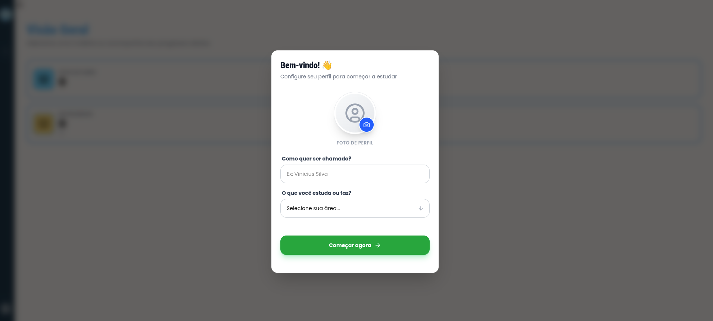

# Flashcard

Aplicação de **flashcards para estudo**, desenvolvida com **React + TypeScript**, com o objetivo principal de praticar conceitos modernos do ecossistema React e melhorar habilidades de organização de projetos front-end.

O projeto permite criar, organizar e revisar flashcards utilizando **categorias (decks)**, com persistência de dados no **localStorage**.

🔗 **Deploy:** https://flashcard-six-pi.vercel.app/

---

# 🚀 Tecnologias utilizadas

* React
* Vite
* TypeScript
* TailwindCSS
* Radix UI
* Lucide React
* React Toastify
* UUID
* React Router

---

# 🧠 Hooks e conceitos utilizados

Durante o desenvolvimento foram utilizados diversos recursos do React:

* useState
* useContext
* useEffect
* useMemo

Além disso, o projeto também trabalha com:

* componentização
* gerenciamento de estado com Context API
* tipagem com TypeScript
* organização de código
* manipulação de localStorage
* gerenciamento de rotas com React Router

---

# ✨ Funcionalidades

* Criar flashcards
* Editar flashcards
* Deletar flashcards
* Virar o card (frente/verso)
* Organização por **categorias / decks**
* Notificações com **toast**
* Persistência de dados com **localStorage**

---

# 📂 Estrutura do projeto

O projeto foi organizado buscando seguir boas práticas de separação de responsabilidades:

src/
adapter/
assets/
components/
context/
hooks/
Layout/
lib/
models/
pages/
routers/
styles/
utils/

Essa organização foi pensada para facilitar a manutenção, escalabilidade e reutilização de código.

---

# 📸 Screenshots

* Página inicial

* Flashcard em uso
* Criação de cards
* Organização por decks

---

# 🎯 Objetivo do projeto

O principal objetivo deste projeto foi **praticar React e TypeScript de forma mais independente**, aplicando conceitos aprendidos na documentação oficial e tentando desenvolver uma aplicação real sem copiar código de tutoriais.

---

# 📚 Aprendizados

Durante o desenvolvimento deste projeto eu pude melhorar principalmente em:

* uso de hooks do React
* lógica de programação
* tipagem com TypeScript
* organização de projetos React
* componentização
* gerenciamento de estado com Context API

---

# 🤖 Uso de IA no projeto

Este projeto teve **uso mínimo de inteligência artificial**.

A maior parte do desenvolvimento foi feita utilizando **documentações oficiais das tecnologias utilizadas**.

A IA foi utilizada apenas em alguns casos específicos:

* para ajudar na **responsividade de alguns componentes**
* quando eu ficava muito tempo travado em alguma lógica específica
* geração da **página 404**

---

# 🧩 Processo de desenvolvimento

Este foi **meu primeiro projeto desenvolvido praticamente sozinho**, sem copiar código de tutoriais ou cursos.

A única parte inspirada externamente foi a **página principal de flashcards**, que teve como referência um desafio do **Frontend Mentor**.

Todo o restante da aplicação — estrutura, lógica, organização e implementação — foi desenvolvido por mim como forma de aprendizado e prática.

Por ser um projeto de estudo, ele pode conter erros ou pontos de melhoria, mas representa um passo importante no meu processo de evolução como desenvolvedor.

---

# ⚙️ Como rodar o projeto

Clone o repositório e instale as dependências:

npm install

Depois inicie o servidor de desenvolvimento:

npm run dev

---

# 🌐 Deploy

O projeto está hospedado na **Vercel**:

https://flashcard-six-pi.vercel.app/

---

# 📌 Observação

Este projeto foi desenvolvido com foco em **aprendizado e prática**, buscando aplicar boas práticas de desenvolvimento front-end e organização de código.

Feedbacks e sugestões são sempre bem-vindos.
